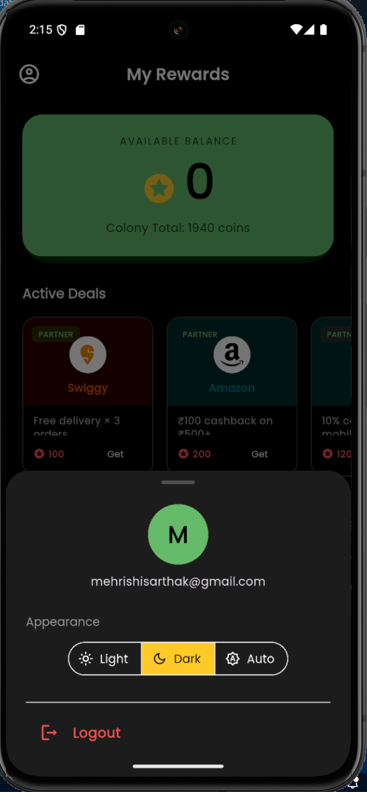
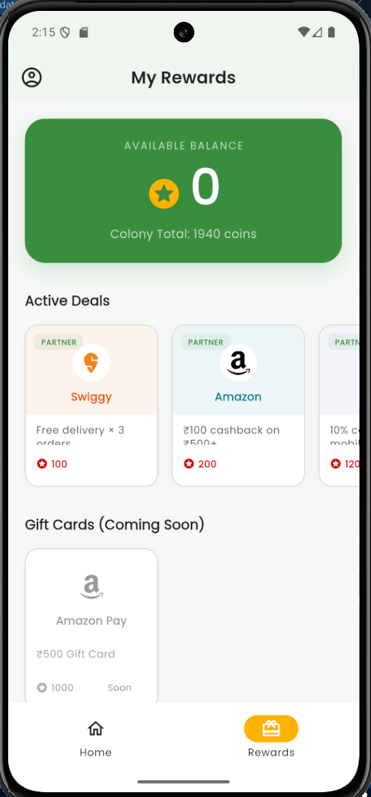
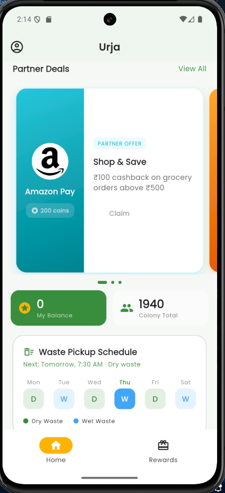
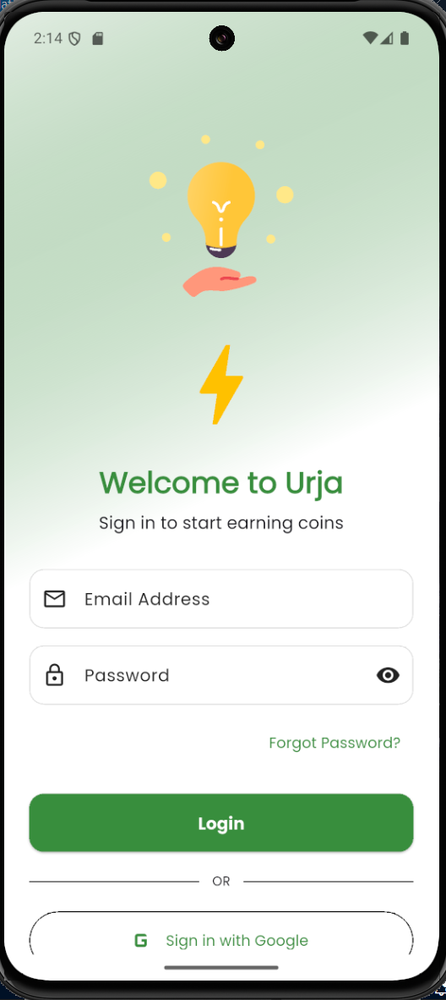
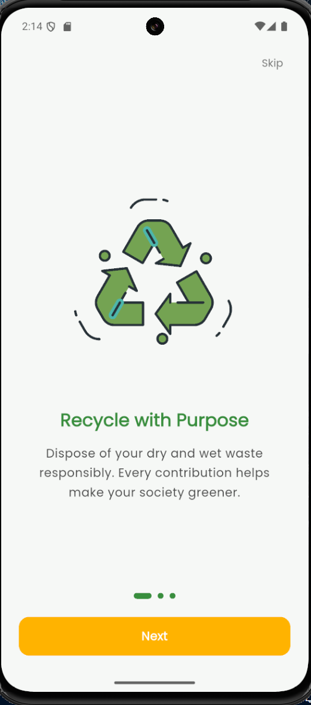
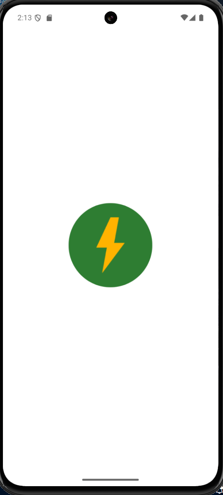
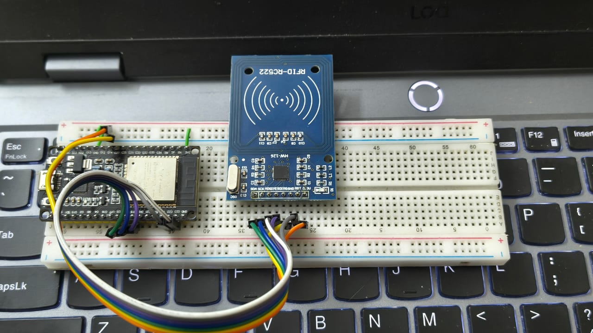

# Urja: Smart Waste Rewards Platform ⚡🌿


**Urja** is an IoT-enabled, tokenized waste management ecosystem that incentivizes residents to segregate and dispose of waste responsibly. It bridges physical collection hardware with a real-time rewards economy — turning green behavior into tangible value.

> *Urja (उर्जा) is the Sanskrit word for "energy" and "power."*

---

## 📸 App Gallery

The app features a modern Material 3 design with Lottie animations, adaptive theming, and a gamified rewards experience.

| **Splash** | **Onboarding** | **Login** |
|:---:|:---:|:---:|
|  |  |  |
| *Animated splash screen* | *Purpose-driven carousel* | *Email & Google Sign-in* |

| **Dashboard** | **Rewards** | **Profile & Theme** |
|:---:|:---:|:---:|
|  |  |  |
| *Live balance, deals & schedule* | *Partner marketplace* | *Dark / Light / Auto mode* |

---

## 🛠️ The Hardware

The physical layer is powered by a custom IoT node — an **ESP32** paired with an **MFRC522 RC522 RFID reader** mounted on the waste collector's trolley.



*Prototype: ESP32 + RC522 RFID reader on breadboard — the edge node that bridges physical waste collection to the Firestore cloud.*

---

## 🚀 Key Features

* **Tokenized Waste Economy:** Residents earn Urja Coins based on weight and quality of waste — redeemable for real partner deals (Swiggy, Amazon, Paytm).
* **IoT Edge Collection:** ESP32 + RC522 node scans the household's RFID-tagged bin at pickup, triggering an atomic Firestore increment.
* **Proportional Batch Rewards:** Individual earnings are multiplied by the facility inspector's quality grade for the whole trolley — peer pressure encoded in math.
* **Zero-Trust CQRS Architecture:** The Flutter app has no write access to coin balances. Only server-side Cloud Functions can mint coins.
* **Intelligent Onboarding FSM:** A multi-stage Finite State Machine guides users through splash → carousel → auth → colony setup.
* **Real-time Ledger:** Firestore listeners push coin balance updates live — no polling, no refresh.
* **Partner Marketplace:** Active deals from partners with coin-based redemption and upcoming gift card support.
* **Waste Schedule:** Dynamic Wet/Dry pickup calendar with next-pickup highlighting.
* **Adaptive Theming:** Full Light, Dark, and Auto modes with Material 3 design.

---

## 🏗️ Technical Architecture

Urja operates across four distinct technical domains, orchestrated by Firebase.

```
┌─────────────────────────────────────────────────────────┐
│                     URJA SYSTEM                         │
│                                                         │
│  [Household RFID Bin] ──tap──▶ [ESP32 + RC522 Trolley] │
│                                        │                │
│                               Cellular Webhook          │
│                                        │                │
│                                        ▼                │
│                              [Firebase Firestore]        │
│                              {householdId, weight,      │
│                               trolleyId}                │
│                                        │                │
│                    ┌───────────────────┤                │
│                    │                   │                │
│                    ▼                   ▼                │
│           [Facility Inspector]   [Cloud Function]       │
│           React/Flutter Web      Proportional Math      │
│           grades: 1–10           Batch + Multiplier     │
│                    │                   │                │
│                    └───────────────────▶               │
│                                        │                │
│                               Atomic Batch Write        │
│                                        │                │
│                                        ▼                │
│                              [Flutter App Ledger]       │
│                              Riverpod Listener          │
│                              Lottie coin animation      │
└─────────────────────────────────────────────────────────┘
```

### Phase 1 — Edge Collection (IoT Hardware)
The collector's trolley carries an ESP32 + RC522 node. When a resident's RFID-tagged bin is tapped, the trolley weighs it before and after dump, then sends a webhook to Firebase with `{householdId, weightAdded, trolleyId}`.

### Phase 2 — The Audit (Facility Grader)
At the facility, an inspector evaluates the trolley's waste batch visually and submits a quality grade (1–10) via a lightweight dashboard — sending `{trolleyId, qualityGrade}` to Firestore.

### Phase 3 — The Brain (Cloud Functions)
A Node.js serverless function joins the two events by `trolleyId`. It runs the **Proportional Distribution** algorithm: `coinsEarned = weight × multiplier(grade)`. An atomic batch write mints coins for every contributing household.

### Phase 4 — The Ledger (Flutter App)
The app listens to `/ledger` subcollections in real-time. It has zero write access to coin fields (CQRS). When the Cloud Function settles, the resident sees a Lottie-animated balance update and receives a push notification.

### Tech Stack

| Component | Technology | Description |
| :--- | :--- | :--- |
| **Frontend** | Flutter (Dart) | Riverpod state management, GoRouter navigation, Lottie, Google Fonts |
| **Backend** | Firebase | Firestore (real-time NoSQL), Cloud Functions (Node.js) |
| **Auth** | Firebase Auth | Email/Password + Google OAuth via `google_sign_in` |
| **IoT Firmware** | C++ / Arduino | Runs on ESP32, communicates via RC522 SPI |
| **UI** | Material 3 | Adaptive light/dark themes, smooth page indicator |
| **Caching** | shared_preferences | Local persistence for onboarding and session state |

---

## 🔬 Technical Novelty

**Hardware Economics — The "Dumb Bag" Pivot**
Most waste startups put RFID chips on disposable bags. Urja attaches the silicon to the *permanent bin* and the *collector's trolley*, dropping per-unit hardware cost by ~99% while maintaining full household accountability.

**Proportional Batch Algorithm**
Individual weight × collective trolley grade = coin payout. If one neighbor contaminates the batch, the multiplier drops for everyone. You don't police residents — the community does it for you.

**Zero-Trust CQRS**
The Flutter frontend cannot write to `personalCoinsEarned`. Ever. Only the Cloud Function can. Client-side spoofing is architecturally impossible.

**Idempotent Event Streams**
Dump events and grade events are joined asynchronously by `trolleyId`. If a trolley loses cellular during collection, the system stays eventually consistent — a hallmark of enterprise distributed systems.

---

## 💻 Getting Started

### Prerequisites

* Flutter SDK (3.9.0+)
* Firebase CLI
* Node.js 18+ (for Cloud Functions)
* Arduino IDE or PlatformIO (for ESP32 firmware)
* ESP32 DevKit board + MFRC522 RC522 RFID module

### 1. Clone the Repository

```bash
git clone https://github.com/yourusername/urja.git
cd urja
```

### 2. Frontend Setup

```bash
# Install dependencies
flutter pub get

# Run the app
flutter run
```

### 3. Firebase Setup

```bash
# Install Firebase CLI
npm install -g firebase-tools

# Login and initialize
firebase login
firebase init
# Select: Firestore, Functions, Authentication
```

Deploy security rules and Cloud Functions:

```bash
cd functions
npm install
firebase deploy --only functions,firestore:rules
```

### 4. App Icon Generation

The app icon uses `flutter_launcher_icons`. Place your 1024×1024 PNG at `assets/icon/app_logo.png`, then run:

```bash
dart run flutter_launcher_icons
```

Config is already set in `pubspec.yaml` with adaptive icon background `#2E7D32`.

---

## 🔧 Hardware Setup — ESP32 + RC522 RFID Node

### 4.1 Prerequisites

* **Arduino IDE** (v2.0+) or **PlatformIO**
* **CP210x / CH340 USB Driver** for your ESP32 board
* Required Arduino libraries (install via Library Manager):
  * `MFRC522` by GithubCommunity
  * `Firebase ESP32 Client` by Mobizt
  * `ArduinoJson` by Benoit Blanchon

### 4.2 Hardware Wiring

```
ESP32               RC522 RFID
3.3V    ──────────  3.3V
GND     ──────────  GND
GPIO5   ──────────  SDA (SS)
GPIO18  ──────────  SCK
GPIO23  ──────────  MOSI
GPIO19  ──────────  MISO
GPIO27  ──────────  RST
```

### 4.3 Firmware Configuration

Update credentials in the firmware before flashing:

```cpp
#define WIFI_SSID         "YOUR_WIFI_SSID"
#define WIFI_PASSWORD     "YOUR_WIFI_PASSWORD"
#define FIREBASE_HOST     "YOUR_PROJECT.firebaseio.com"
#define FIREBASE_API_KEY  "YOUR_API_KEY"
#define TROLLEY_ID        "TROLLEY_001"
```

### 4.4 Flashing

1. Open `esp32/urja_rfid_node/urja_rfid_node.ino` in Arduino IDE
2. Select **Tools → Board → ESP32 Dev Module**
3. Set Upload Speed to **115200**
4. Select your COM port
5. Click **Upload**

**Expected Serial Output:**
```
╔══════════════════════════════╗
║    URJA NODE BOOTING         ║
╚══════════════════════════════╝

✓ Wi-Fi connected: 192.168.1.42
✓ Firebase initialized
→ Ready to scan RFID tags...

[SCAN] Tag detected: A3:F2:01:CC
[WEIGH] Before: 1240g | After: 1890g | Delta: 650g
[PUSH] Firestore write OK — householdId: apt_304
```

### 4.5 Firestore Data Flow

The node sends atomic increments directly to the colony's document:

```json
{
  "trolleyId": "TROLLEY_001",
  "householdId": "apt_304",
  "weightGrams": 650,
  "timestamp": "2026-06-04T08:30:00Z"
}
```

### 4.6 Troubleshooting

| Issue | Solution |
|-------|----------|
| RC522 not detected | Check SPI wiring, confirm 3.3V power (not 5V) |
| Firebase write fails | Verify API key and Firestore security rules allow node writes |
| Tag not recognized | Ensure RFID sticker is within 3–4 cm of reader |
| Wi-Fi won't connect | Confirm 2.4GHz network (ESP32 doesn't support 5GHz) |
| Serial output garbled | Set baud rate to 115200 in Serial Monitor |

---

## 📂 Project Structure

```
urja/
├── lib/
│   ├── main.dart                    # Entry point
│   ├── firebase_options.dart
│   ├── core/
│   │   ├── constants/
│   │   ├── providers/
│   │   ├── routing/                 # GoRouter configuration
│   │   ├── services/
│   │   ├── shared_widgets/
│   │   └── theme/
│   └── features/
│       ├── authentication/          # Login, registration, Google OAuth
│       │   ├── data/
│       │   ├── domain/
│       │   ├── notifiers/
│       │   ├── presentation/
│       │   └── providers/
│       ├── colony_ledger/           # Dashboard, coins, redemption
│       │   ├── data/
│       │   ├── domain/
│       │   ├── notifiers/           # ColonyLedgerNotifier
│       │   └── presentation/
│       └── waste_tracking/          # Colony search, RFID connection
│           ├── data/
│           ├── domain/
│           ├── notifiers/
│           └── presentation/
├── esp32/
│   └── urja_rfid_node/
│       ├── urja_rfid_node.ino       # Main firmware
│       └── src/
│           └── main.cpp
├── functions/                       # Firebase Cloud Functions (Node.js)
│   └── index.js                     # Proportional distribution logic
├── assets/
│   ├── icon/
│   │   └── app_logo.png
│   ├── lottie/                      # coins, colony, recycle, truck, energy_bulb
│   └── screenshot/
└── pubspec.yaml
```

---

## 🔐 Security & Best Practices

* Firestore rules enforce that only the Cloud Function service account can write to `personalCoinsEarned` — clients have read-only access to their own ledger.
* Atomic `FieldValue.increment()` operations prevent race conditions across multiple simultaneous RFID scans.
* Never commit `firebase_options.dart`, `.env`, or service account JSON to version control.
* RFID tag IDs are hashed server-side before storage — raw UIDs are never persisted.
* All device-to-cloud communication uses HTTPS with Firebase's managed certificates.
* Provisioning tokens for new trolley nodes are single-use and expire after 10 minutes.

---

## 🤝 Contributing

Contributions are welcome! Please fork the repository and submit a pull request.

1. Fork the Project
2. Create your Feature Branch (`git checkout -b feature/AmazingFeature`)
3. Commit your Changes (`git commit -m 'Add some AmazingFeature'`)
4. Push to the Branch (`git push origin feature/AmazingFeature`)
5. Open a Pull Request

---

## 📄 License

Distributed under the MIT License. See `LICENSE` for more information.

---

## 🔗 Resources

* [Flutter Documentation](https://docs.flutter.dev/)
* [Firebase Firestore](https://firebase.google.com/docs/firestore)
* [Riverpod State Management](https://riverpod.dev/)
* [MFRC522 Arduino Library](https://github.com/miguelbalboa/rfid)
* [Firebase Cloud Functions](https://firebase.google.com/docs/functions)
* [GoRouter Navigation](https://pub.dev/packages/go_router)

---

**Developed with ❤️ by Sarthak Mehrishi**
